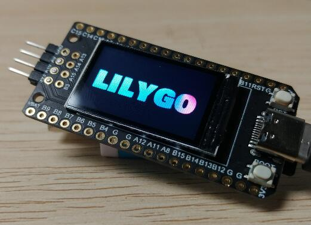

# T-Display_GD32

| Pins       | GD32V           |
| ---------- | --------------- |
| TFT Driver | ST7789(240*135) |
| TFT_MISO   | N/A             |
| TFT_MOSI   | PA7             |
| TFT_SCLK   | PA5             |
| TFT_CS     | PB2             |
| TFT_DC     | PB0             |
| TFT_RST    | PB1             |
| TFT_BL     | PB10            |
| SD_MISO    | PB14            |
| SD_MOSI    | PB15            |
| SD_SCLK    | PB13            |
| SD_CS      | PB12            |

- Copy the files in the `resource` folder to the SD card
- Quick use reference [get_started](http://longan.sipeed.com/en/get_started/pio.html)